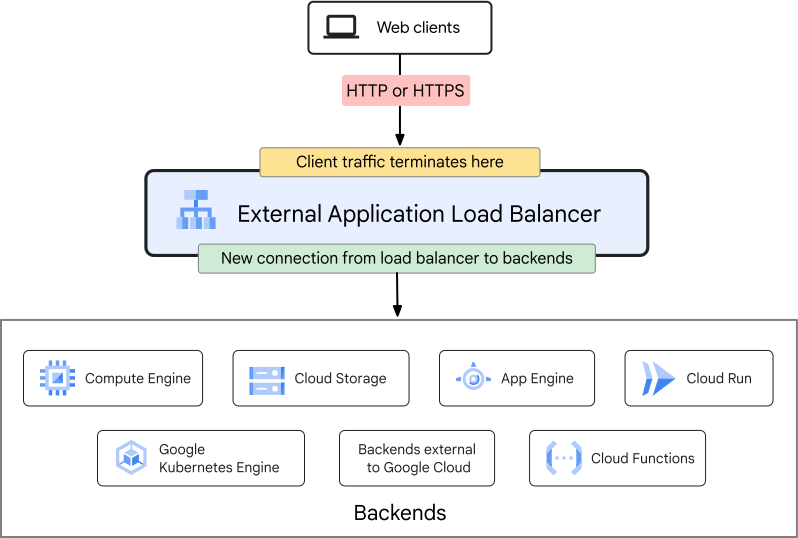
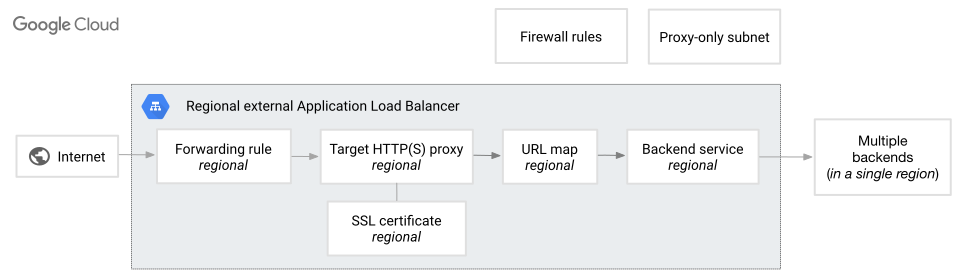

# SEIR-1/Class 7.5: Prep notes for week 8

## Introduction

## Background info

- Load Balancing:
- Proxy
- Autohealing 
- Autoscaling 

## Architecture discussion 
 
A very basic diagram of what we are building can be found here. This diagram should be used for basic intuition only. It shows the idea of External Application (HTTP) Load Balancers. Looking at it we can see that clients (like web browsers outside of the cloud) can use HTTP (or HTTPS) to connect to the External Application Load Balancer (I will just call it an ALB). The ALB "terminates" the client traffic (meaning the client is no longer making the request when it is done) and by use of forwarding rules we send the traffic to our choice of backend. For this lab we will use Instance Groups (specifically Managed Instance Groups). 

 

Next we see a Regional External Application Load Balancer's internal workings. We will be using a regional load balancer for today's lab (meaning it can use backends in the regional the LB itself is in as opposed to global LBs). This is everything that makes up the load balancer. Keep this in mind. 

The first thing to note is the firewall rules and proxy-only subnet. We need appropriate firewall rules and a special subnet in addition to the subnet our backend will use. Since this is an external load balancer we are not setting firewall rules to allow traffic _from the internet_. Our traffic hitting the backend VMs is coming _from the load balancer_ (specifically the Proxy-only subnet). Our load balancer uses something called an Envoy proxy. This takes traffic coming from the forwarding rule and feeds it into the Envoy proxy. The proxy lives in the Proxy-only subnet. It need sends the traffic to the URL map to get send to the backend service. This is important to understand. The traffic comes to the backend _from_ the Envoy proxy. 

Next lets discuss the rest of what we see. The forwarding rule is simple something that tells the VPC "we have a static IP and when some traffic comes to it that matches these policies send it to the Envoy proxy". Ignore the SSL certificate since we aren't using HTTPS right now. Next is the Target HTTP proxy. This is the Envoy proxy itself. Then we have the URL map. The URL map examines the traffic and if it sees a certain pattern it can be configured to send that traffic to certain VMs or other backends. Say we have a backend for our Thai "gallery" and a backend for our Brazil "gallery". Different websites are in each. We tell the URL map that if somebody tries to load the page `http://43.10.46.100/thai` to send them to the backend running the thai gallery and if somebody tries to go to `http://43.10.46.100/brazil` then send them to the backend running the brazil gallery. Finally we have the backend service which has settings and health checks to make sure the backend VMs are healthy (are they running correctly?) and if not it does not send traffic there. Finally we have the actual backends. 

## Resources Used

### MIG
google_compute_region_instance_template
google_compute_region_health_check 
google_compute_region_instance_group_manager
google_compute_region_autoscaler

### Load Balancer 
google_compute_region_health_check
google_compute_region_backend_service
google_compute_address
google_compute_forwarding_rule
google_compute_region_target_http_proxy
google_compute_region_url_map

